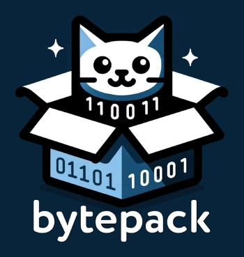

# BytePack: Simple C++ Binary Serialization Library
<p align="center">
  
</p>

[](https://github.com/farukeryilmaz/bytepack/blob/main/LICENSE)
[](https://github.com/farukeryilmaz/bytepack/actions/workflows/platform_windows.yml)
[](https://github.com/farukeryilmaz/bytepack/actions/workflows/platform_gnu_linux.yml)
[](https://github.com/farukeryilmaz/bytepack/actions/workflows/platform_macos.yml)

Header-only C++20 library primarily designed for network communication, focusing on efficient and flexible binary serialization and deserialization. It allows users to specify endianness and does not enforce specific standardization (IDL, metadata, etc.), making it highly adaptable for projects that rely on external interface, custom data formats, such as those found in Interface Control Documents (ICD), Interface Design Description (IDD), and similar specifications. BytePack seamlessly works with such specifications, making it straightforward to integrate into existing systems.

## Features
- **Header-Only:** Easy to integrate, just include `bytepack.hpp` in your project.
- **No Library-Specific Encoding:** Avoids any custom encoding (IDL, metadata, etc.) facilitating interoperability and simplifying the troubleshooting of network packets.
- **Configurable Endianness Support:** Choose the desired endianness for data serialization and deserialization.
- **No Exceptions:** Ensures stable and predictable error handling.
- **Flexible Buffer Management:** Utilizes a non-owning mutable buffer concept for efficient memory management.
- **Easy to Debug and Customize:** Clear and concise codebase makes debugging easy. Adaptable for customization to address specific requirements.
- **Cross-platform compatible:** Tested on `Windows`, `GNU/Linux` and `macOS`.

## Usage Example
This example illustrates the diverse applications and potential of BytePack, encouraging exploration of its many possible use cases.
> * For more practical examples: [Example Codes: ASIO, Qt, and Raw Sockets](examples/README.md)  
> * For detailed usage, please read [User Guide & API Reference](doc/user_guide.md)

```cpp
// Sample struct for a conceptual usage scenario
struct SensorData {
  std::int64_t timestamp; // UNIX timestamp of measurement
  double value;           // Measured value
  char sensor_id[16];     // Identifier of the sensor

  void serialize(bytepack::binary_stream<>& stream) const {
    stream.write(timestamp, value, sensor_id);
  }

  void deserialize(bytepack::binary_stream<>& stream) {
    stream.read(timestamp, value, sensor_id);
  }
};

SensorData sensorData{ 1701037875, 23.6, "Sensor-001" };

// Default endianness is big-endian (network byte order).
// little-endian configuration: `bytepack::binary_stream<std::endian::little>`
// You can also supply your own buffer to serialize onto.
bytepack::binary_stream serializationStream(64); // 64 is the buffer size in bytes

sensorData.serialize(serializationStream);

bytepack::buffer_view buffer = serializationStream.data();

// e.g. char* dataPtr = buffer.as<char>();
std::uint8_t* dataPtr = buffer.as<std::uint8_t>();
std::size_t dataSize = buffer.size(); // returns the serialized data size in bytes
// you can send the dataPtr to a socket, etc.

// If you want to deserialize the data coming from a socket, etc.,
// you can initialize non-owning mutable buffer with the data pointer and size.
// e.g. `bytepack::buffer_view buffer(dataPtr, dataSize);`
bytepack::binary_stream deserializationStream(buffer);

SensorData sensorData_{};
sensorData_.deserialize(deserializationStream);
```

## Requirements
- Implemented in `C++20` (uses concepts)
- `CMake 3.12` or higher.
- **GNU/Linux:** `GCC 10.1` or higher, `Clang 11` or higher.
- **Windows:** `Visual Studio 2019 version 16.11.14` or higher.
- **macOS:** `Xcode 14.3` or higher.

## Installation
Simply clone the repository or [download](https://github.com/farukeryilmaz/bytepack/blob/main/include/bytepack/bytepack.hpp) the `bytepack.hpp` file and include it in your project.
```bash
git clone https://github.com/farukeryilmaz/bytepack.git
```
Include the library in your C++ project:
```cpp
#include <bytepack/bytepack.hpp>
```

## Design Philosophy
BytePack is a C++ library crafted with a clear focus on simplicity and flexibility in binary serialization, primarily for network communication. It does not enforce any standardization, versioning, or the use of Interface Description Language (IDL) in serialization, providing you with the freedom to define your data structures and protocols. This approach is ideal when interfacing with systems where data formats and protocols are defined externally, as is often the case in standards like IEEE 12207, Interface Control Documents (ICD), Interface Design Description (IDD), and other industry-specific specifications. It allows you to seamlessly integrate BytePack into diverse projects, accommodating a wide range of requirements and compliance standards.
> For more details: [Motivation & Design Philosophy of BytePack](doc/design_philosophy.md)

## Contributions and Feedback
Contributions are welcome! If you encounter issues, have suggestions, or want to contribute to the development of the library, please read the [Contribution Guideline](CONTRIBUTING.md).

For any questions, feedback, or inquiries, you can also reach out to me directly:
- **Email:** `faruk [at] farukeryilmaz [dot] com`
- **X (Twitter):** [@farukerylmz](https://twitter.com/farukerylmz)

## License
`BytePack` is licensed under the [MIT License](https://github.com/farukeryilmaz/bytepack/blob/main/LICENSE).

**Note:** Example codes in the `examples` folder are provided for demonstration purposes only and is not covered under any specific license terms. Users are free to use it as they wish.